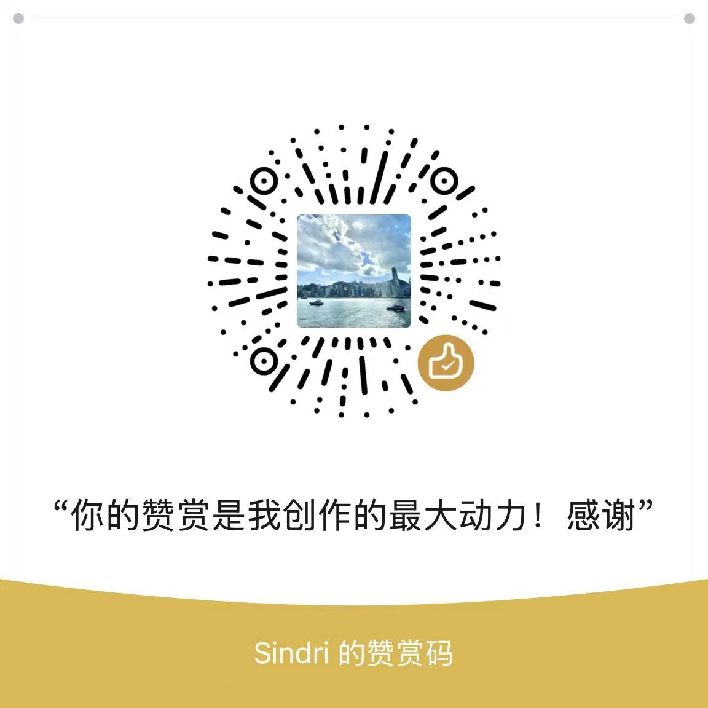

# S-Hy2 Manager

<div align="center">

 Hysteria2 代理服务器部署和管理的 Shell 脚本工具

[快速开始](#快速安装)  • [更新日志](#更新日志) • [贡献指南](#贡献指南)

</div>

## 功能特色

- 🚀 **一键部署** - 自动安装和配置 Hysteria2 服务
- ⚙️ **配置管理** - 支持快速配置和手动配置
- 🔐 **证书管理** - 自动 ACME 证书或自签名证书
- 🌐 **出站规则** - 支持 Direct、SOCKS5、HTTP 代理模式
- 🛡️ **防火墙管理** - 自动检测和配置防火墙规则
- 📱 **订阅链接** - 生成多客户端兼容的订阅链接

## 快速安装

### 一键安装
```bash
curl -fsSL https://raw.githubusercontent.com/sindricn/s-hy2/main/quick-install.sh | sudo bash
sudo s-hy2
```

### 手动安装
```bash
git clone https://github.com/sindricn/s-hy2.git
cd s-hy2
chmod +x hy2-manager.sh scripts/*.sh
sudo ./hy2-manager.sh
```

## 系统要求

- Ubuntu 18.04+ / Debian 9+ / CentOS 7+
- 需要 root 或 sudo 权限
- 支持 systemd 的 Linux 系统


## 更新日志

### v1.1.2 (2025-10-01)
**🐛 问题修复**
- 修复安装 Hysteria2异常报错

### v1.1.1 (2024-10-01)
**🐛 问题修复**
- 修复安装 Hysteria2 模块时脚本路径异常问题
- 修复出站规则删除配置文件规则时闪退问题
- 修复规则匹配逻辑，支持带引号和不带引号的规则名

**✨ 功能优化**
- 优化伪装域名优选策略，添加 DNS 解析有效性判断
- 优化出站规则状态检查逻辑，统一状态判断函数
- 优化规则来源检测，使用关联数组提升准确性

### v1.1.0 (2024-09-29)
**🚀 主要更新**
- 新增智能出站规则管理
- 新增防火墙自动检测和管理

### v1.0.0 (2024-08-01)
- 初始版本发布
- 基础 Hysteria2 部署功能

## 贡献指南

### 如何贡献
1. Fork 这个项目
2. 创建功能分支 (`git checkout -b feature/AmazingFeature`)
3. 提交更改 (`git commit -m 'Add some AmazingFeature'`)
4. 推送到分支 (`git push origin feature/AmazingFeature`)
5. 创建 Pull Request

### 开发规范
- 使用 shellcheck 检查代码质量
- 遵循现有的代码风格
- 为新功能添加相应的文档
- 确保脚本在不同 Linux 发行版上的兼容性

## 获取帮助

**问题反馈**
- 🐛 [提交 Bug](https://github.com/sindricn/s-hy2/issues/new?template=bug_report.md)
- 💡 [功能建议](https://github.com/sindricn/s-hy2/issues/new?template=feature_request.md)


## 赞助支持

如果这个项目对你有帮助，可以请作者喝杯咖啡 ☕

<div align="center">



*扫码支持项目发展*

</div>

## 致谢

感谢以下项目和贡献者：
- [Hysteria](https://hysteria.network/) - 提供优秀的代理协议


<div align="center">

**⭐ 如果这个项目对你有帮助，请给个 Star ⭐**

[](https://github.com/sindricn/s-hy2/stargazers)
[](https://github.com/sindricn/s-hy2/network/members)

[报告问题](https://github.com/sindricn/s-hy2/issues) • [提交建议](https://github.com/sindricn/s-hy2/discussions) • [参与贡献](#贡献指南)

</div>