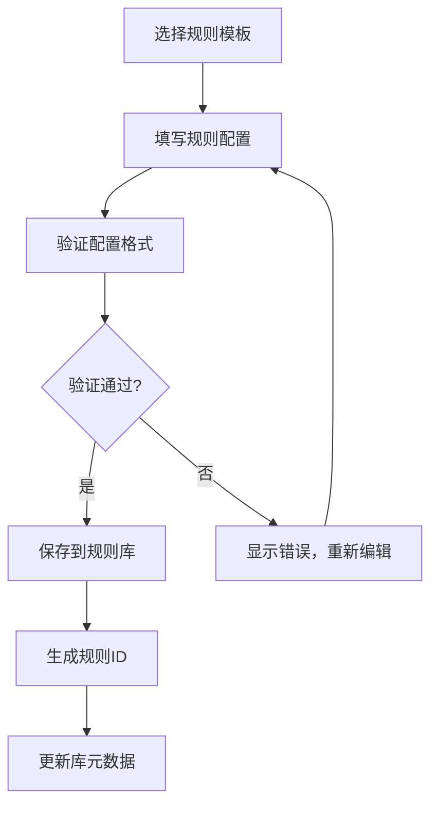
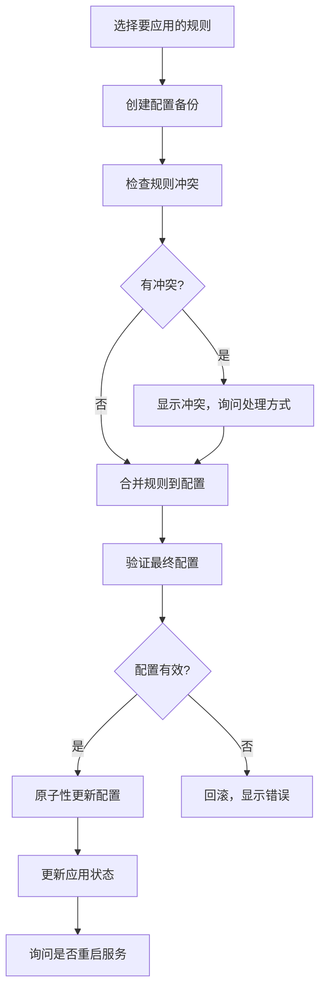
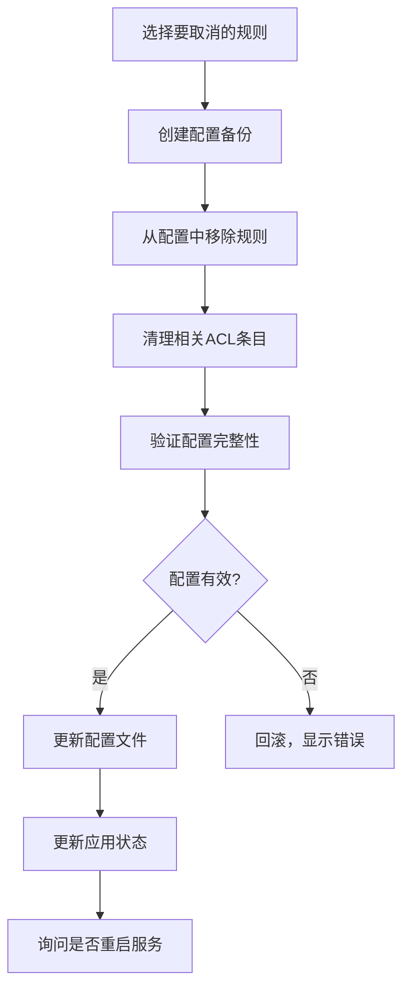

# 出站规则管理架构设计

## 🎯 架构目标

### 核心设计原则
- **关注点分离**：规则管理 vs 配置应用完全解耦
- **CRUD完整性**：创建、读取、更新、删除规则的完整生命周期
- **状态管理**：规则库状态与配置文件状态独立维护
- **向后兼容**：保留现有功能，平滑升级路径

### 系统边界定义
```
┌─────────────────┐    ┌─────────────────┐    ┌─────────────────┐
│   规则库管理    │    │   状态管理器    │    │  配置文件应用   │
│   (Rule Store)  │◄──►│ (State Mgr)     │◄──►│ (Config Apply)  │
└─────────────────┘    └─────────────────┘    └─────────────────┘
```

## 📁 数据存储架构

### 1. 规则库结构 (`/etc/hysteria/rules/`)
```yaml
# rules-library.yaml - 规则定义库
metadata:
  version: "2.0"
  created: "2025-09-28T10:00:00Z"
  last_modified: "2025-09-28T10:00:00Z"
  total_rules: 5

rules:
  direct_china:
    id: "rule_001"
    name: "direct_china"
    type: "direct"
    description: "中国大陆直连"
    tags: ["direct", "china", "bypass"]
    created: "2025-09-28T10:00:00Z"
    modified: "2025-09-28T10:00:00Z"
    config:
      direct:
        mode: "auto"
        bindDevice: "eth0"
        bindIPv4: "192.168.1.100"

  proxy_global:
    id: "rule_002"
    name: "proxy_global"
    type: "socks5"
    description: "全局SOCKS5代理"
    tags: ["proxy", "socks5", "global"]
    created: "2025-09-28T10:00:00Z"
    modified: "2025-09-28T10:00:00Z"
    config:
      socks5:
        addr: "proxy.example.com:1080"
        username: "user123"
        password: "pass123"
```

### 2. 应用状态管理 (`/etc/hysteria/rules/`)
```yaml
# applied-rules.yaml - 当前应用状态
metadata:
  version: "2.0"
  last_applied: "2025-09-28T10:30:00Z"
  hysteria_config: "/etc/hysteria/config.yaml"

applied_rules:
  - rule_id: "rule_001"
    rule_name: "direct_china"
    applied_at: "2025-09-28T10:30:00Z"
    acl_rules:
      - "direct_china(geoip:cn)"
      - "direct_china(geosite:cn)"

  - rule_id: "rule_002"
    rule_name: "proxy_global"
    applied_at: "2025-09-28T10:30:00Z"
    acl_rules:
      - "proxy_global(all)"

backup_config:
  backup_path: "/etc/hysteria/backups/config_20250928_103000.yaml"
  created_at: "2025-09-28T10:30:00Z"
```

### 3. 规则模板库 (`/etc/hysteria/templates/`)
```yaml
# rule-templates.yaml - 预定义模板
templates:
  china_direct:
    name: "中国大陆直连"
    type: "direct"
    description: "绕过中国大陆IP段，使用直连"
    default_config:
      direct:
        mode: "auto"
    default_acl:
      - "{rule_name}(geoip:cn)"
      - "{rule_name}(geosite:cn)"

  socks5_proxy:
    name: "SOCKS5代理"
    type: "socks5"
    description: "通过SOCKS5代理服务器转发流量"
    default_config:
      socks5:
        addr: "127.0.0.1:1080"
    default_acl:
      - "{rule_name}(all)"
```

## 🔧 核心组件架构

### 1. 规则库管理器 (Rule Library Manager)
```bash
# 文件: scripts/rule-library-manager.sh

core_functions:
  - create_rule()      # 创建新规则到库
  - list_rules()       # 列出所有规则
  - get_rule()         # 获取指定规则详情
  - update_rule()      # 更新规则配置
  - delete_rule()      # 从库中删除规则
  - import_rule()      # 从JSON/YAML导入
  - export_rule()      # 导出规则到文件
  - validate_rule()    # 规则格式验证
```

### 2. 状态管理器 (State Manager)
```bash
# 文件: scripts/rule-state-manager.sh

core_functions:
  - get_applied_rules()    # 获取当前应用的规则
  - apply_rule()           # 应用规则到配置
  - unapply_rule()         # 取消应用规则
  - sync_state()           # 同步状态与配置文件
  - create_backup()        # 创建配置备份
  - restore_backup()       # 恢复配置备份
  - validate_state()       # 验证状态一致性
```

### 3. 配置应用器 (Config Applier)
```bash
# 文件: scripts/config-applier.sh

core_functions:
  - apply_rules_to_config()    # 批量应用规则
  - remove_rules_from_config() # 批量移除规则
  - merge_outbound_section()   # 合并outbound配置
  - merge_acl_section()        # 合并ACL配置
  - validate_config()          # 验证最终配置
  - atomic_update()            # 原子性配置更新
```

## 🎮 用户界面设计

### 1. 规则库管理界面
```
=== 出站规则库管理 ===

当前规则库: 5 个规则
├── direct_china (直连) - 已应用 ✅
├── proxy_global (SOCKS5) - 已应用 ✅
├── http_corp (HTTP) - 未应用 ⭕
├── backup_socks (SOCKS5) - 未应用 ⭕
└── cdn_direct (直连) - 未应用 ⭕

操作选项:
1. 查看规则详情
2. 创建新规则
3. 编辑规则
4. 删除规则
5. 导入/导出规则
6. 规则应用管理 →
```

### 2. 规则应用管理界面
```
=== 规则应用管理 ===

当前Hy2配置状态:
├── 已应用规则: 2 个
│   ├── direct_china (2025-09-28 10:30)
│   └── proxy_global (2025-09-28 10:30)
├── 备份配置: config_20250928_103000.yaml
└── 配置状态: 同步 ✅

操作选项:
1. 应用新规则
2. 取消规则应用
3. 批量规则管理
4. 查看配置差异
5. 恢复配置备份
6. 重新同步状态
```

## 🔄 工作流程设计

### 1. 规则创建流程


### 2. 规则应用流程


### 3. 规则取消应用流程


## 📋 接口设计规范

### 1. 规则库接口
```bash
# 创建规则
rule_library_create() {
    local name="$1" type="$2" config="$3" description="$4"
    # 返回: rule_id 或错误码
}

# 列出规则
rule_library_list() {
    local filter="$1"  # 可选过滤条件
    # 返回: JSON格式规则列表
}

# 获取规则
rule_library_get() {
    local rule_id="$1"
    # 返回: JSON格式规则详情
}

# 更新规则
rule_library_update() {
    local rule_id="$1" field="$2" value="$3"
    # 返回: 成功/失败状态码
}

# 删除规则
rule_library_delete() {
    local rule_id="$1"
    # 返回: 成功/失败状态码
}
```

### 2. 状态管理接口
```bash
# 应用规则
state_apply_rule() {
    local rule_id="$1"
    # 返回: 成功/失败状态码
}

# 取消应用
state_unapply_rule() {
    local rule_id="$1"
    # 返回: 成功/失败状态码
}

# 获取状态
state_get_applied() {
    # 返回: JSON格式已应用规则列表
}

# 同步状态
state_sync() {
    # 返回: 同步结果状态
}
```

## 🔄 迁移策略

### 1. 现有规则提取
```bash
# 从当前config.yaml提取规则到新架构
migrate_existing_rules() {
    # 1. 解析当前outbound配置
    # 2. 转换为新规则库格式
    # 3. 生成应用状态记录
    # 4. 创建配置备份
}
```

### 2. 渐进式迁移
```bash
Phase 1: 保留现有功能，增加新规则库管理
Phase 2: 新规则使用新架构，现有规则兼容
Phase 3: 完全迁移到新架构，移除旧代码
```

### 3. 兼容性保证
```bash
# 检测配置格式版本
detect_config_version() {
    # v1: 直接嵌入式配置
    # v2: 新架构规则库模式
}

# 自动升级配置格式
upgrade_config_format() {
    # 从v1迁移到v2
}
```

## 🎯 性能优化

### 1. 缓存策略
- 规则库内存缓存
- 配置文件变更检测
- 增量状态同步

### 2. 批量操作
- 批量规则应用/取消
- 事务性配置更新
- 并行规则验证

### 3. 错误恢复
- 自动配置备份
- 原子性操作保证
- 状态一致性检查

## 🔒 安全考虑

### 1. 权限控制
- 规则库文件权限: 600
- 配置文件原子更新
- 备份文件管理

### 2. 输入验证
- 规则配置格式验证
- YAML语法检查
- 参数类型检查

### 3. 操作审计
- 规则变更日志
- 配置应用记录
- 错误操作追踪